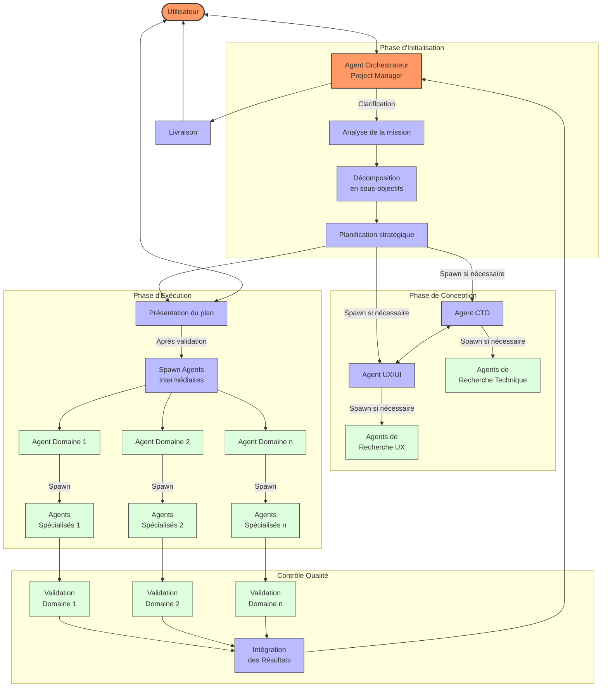

# AutoAgent : Système Multi-Agents pour l'Exécution de Projets Complexes

## Vue d'ensemble

Ce projet implémente une architecture multi-agents hiérarchique pour exécuter des missions complexes. Le système repose sur une orchestration centralisée avec délégation progressive des tâches à des agents spécialisés, permettant une décomposition efficace des problèmes et une exécution parallèle optimisée.

## Architecture du Système

Le système s'articule autour de trois niveaux principaux d'agents :

1. **Agent Orchestrateur (Project Manager)** : Coordonne l'ensemble du projet, interagit directement avec l'utilisateur, et décompose la mission en sous-objectifs majeurs.

2. **Agents Intermédiaires (Domain Specialists)** : Experts dans des domaines spécifiques (comme CTO, UX/UI Designer), responsables de sous-tâches complexes et de la coordination d'agents spécialisés.

3. **Agents Spécialisés** : Exécutent des tâches précises et ciblées sous la supervision des agents intermédiaires.

## Flux de Travail

## Processus Détaillé

1. **Interaction Initiale**
   - L'utilisateur soumet une mission à l'Agent Orchestrateur
   - L'Agent Orchestrateur engage un dialogue de clarification pour définir précisément les objectifs, contraintes et critères de succès

2. **Planification Stratégique**
   - Décomposition MECE (Mutuellement Exclusive, Collectivement Exhaustive) de la mission
   - Consultation des agents experts (CTO, UX/UI) pour les aspects techniques et conception
   - Élaboration d'un plan global avec allocation de ressources

3. **Validation Utilisateur**
   - Présentation du plan complet à l'utilisateur
   - Ajustements basés sur les retours
   - Obtention d'une validation formelle avant exécution

4. **Exécution Distribuée**
   - Création d'agents intermédiaires avec des périmètres d'action précis et indépendants
   - Chaque agent intermédiaire supervise des agents spécialisés exécutant des tâches atomiques
   - Validation systématique des livrables à chaque niveau

5. **Synthèse et Livraison**
   - Intégration des résultats par l'Agent Orchestrateur
   - Validation finale
   - Livraison à l'utilisateur avec documentation complète

## Points Forts du Système

- **Décomposition Efficace** : Division MECE des problèmes complexes
- **Exécution Parallèle** : Traitement simultané des tâches indépendantes
- **Spécialisation** : Agents optimisés pour des domaines précis
- **Coordination Structurée** : Communication inter-agents formalisée
- **Validation Systématique** : Contrôle qualité à chaque niveau d'exécution

Le système est conçu pour être adaptable à différents types de projets tout en maintenant une structure cohérente et une méthodologie rigoureuse.
